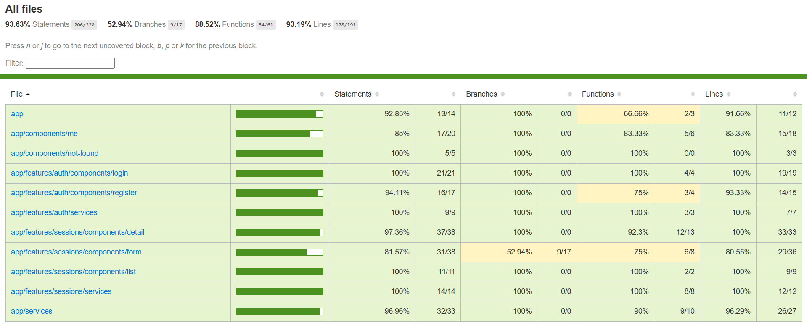
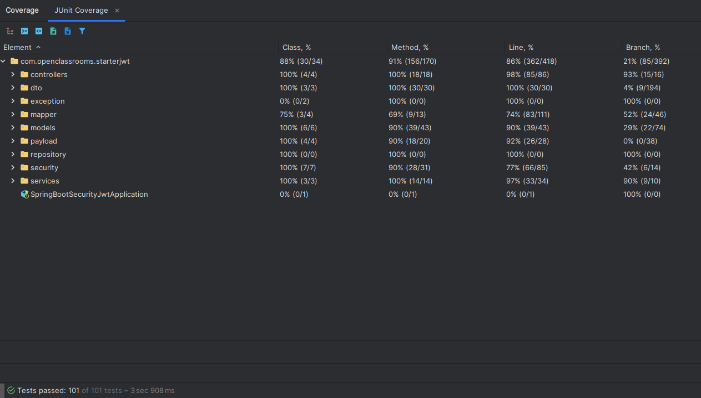

 

# 🪳 Projet 5 - Testez une application full-stack

L'objectif de ce projet est de tester une application Fullstack.

## 📖 Sommaire

- [Projet](#-projet)
    - [Prérequis](#prérequis)
    - [Front-end](#front-end)
    - [Back-end](#back-end)
    - [Taux de couverture](#taux-de-couverture)
- [Etape de conception](#etape-de-conception)
- [Ressources](#ressources)

## 📁 Projet

### Prérequis

1. Fork ou cloner ce projet
2. Installer [MySQL 8 command Line](https://openclassrooms.com/fr/courses/6971126-implementez-vos-bases-de-donnees-relationnelles-avec-sql/7152681-installez-le-sgbd-mysql) ou avec [Docker](https://spring.io/guides/gs/accessing-data-mysql)
3. Installer la partie [Front-end](#front-end)
4. Installer la partie [Back-end](#back-end)

### Front-end

[Lien README du Front-end](./front/README.md)

### Back-end

[Lien README du Back-end](./back/README.md)

### Taux de couverture

#### Front

> [!NOTE]
> Le rapport de couverture Cypress n'est pas affiché, car il cible le dernier fichier cy.ts testé.
> Les tests E2E réalisé couvre plus de 80% de l'application.

#### Back

## Etape de conception

### [STEP 1 - Tests Front-end](https://github.com/Tom-DevWeb/OC-DA_Angular_Java-P5_Yoga-App/pull/1)

Test unitaire et d'intégration sur la partie Front-end.

### [STEP 2 - Test e2e Cypress](https://github.com/Tom-DevWeb/OC-DA_Angular_Java-P5_Yoga-App/pull/2)

Réalisation des tests End-to-End sur le Front-end avec Cypress.

### [STEP 3 - Tests Back-end](https://github.com/Tom-DevWeb/OC-DA_Angular_Java-P5_Yoga-App/pull/3)

Test unitaire et d'intégration sur la partie Back-end.

### [STEP 4 - Rédaction README](https://github.com/Tom-DevWeb/OC-DA_Angular_Java-P5_Yoga-App/pull/4)

Rédaction du README et de la documentation.

## Ressources

- Script SQL
- Collection Postamn
- Images

