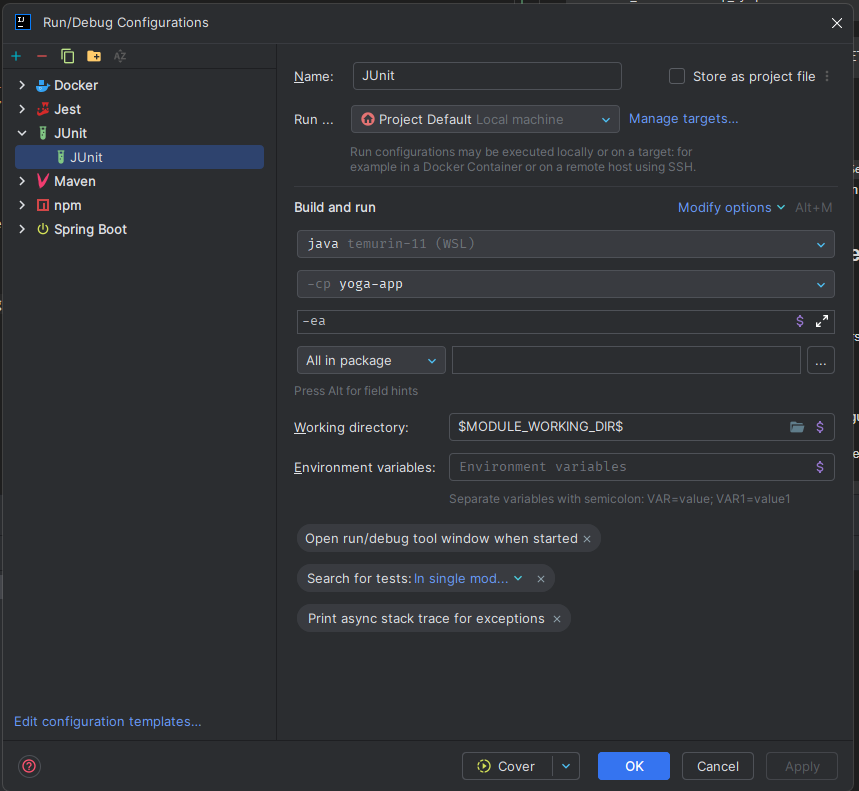

# Back-end Spring boot

## Prérequis installation

### Installation MySQL avec Docker Compose

Dans le dossier `back`, créer un fichier `.env` avec :

```
MYSQL_DATABASE=yoga-app_sql_oc (par exemple)
MYSQL_ROOT_PASSWORD=mdp_mtsql
```

Pour lancer Docker Compose faire : `docker compose up `

> [!IMPORTANT]
> Avant de lancer la commande n'oubliez pas de :
> - Démarrer Docker Desktop
> - Ou d'installer docker sur votre environnement linux

### Variable d'environnement Spring Boot

Configurer les variables d'environnement directement sur Intellij:

`Run` > `Edit Configuration` > `Modify options` > cocher `Variable environment` >
Dans le champ `Environment variables` cliquer sur `$`

Liste des variables d'environnement :

```
DATABASE_USERNAME -> identifiant_mysql
DATABASE_PASSWORD -> mdp_mysql
```
> [!TIP]
> Vous pouvez générer votre JWT_SECRET_KEY avec la commande:
> `openssl rand -base64 32`

## Build le projet

1. Cliquer sur le bouton **play** `Run 'SpringBootSecurityJwtApplication'` dans la barre en haut d'**IntelliJ**.
2. Soit, vous faites des requêtes depuis postman `resources/postman` ou cloner et démarrer le front-end.

## Démarrer les tests unitaires et d'intégration

### TU ou TI

Lancer les tests individuellement depuis les fichiers test présent dans le package `test`

### Test de couverture

Dans la barre en haut d'**IntelliJ**, ajouter une configuration JUnit :



Appuyer sur le bouton Cover.

Ou lancer et générer un jacoco code coverage en faisant : `mvn clean test`